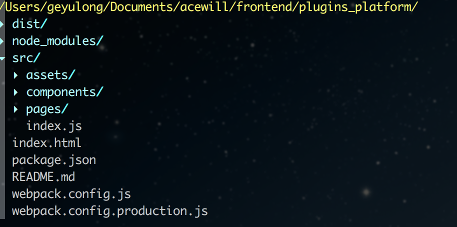

# webpack

## 简介

webpack是一个模块打包工具.

web开发中常用到的静态资源，主要是js,css,img, jade,等文件，webpack中，将静态资源文件称为模块。其可以兼容多种js书写规范(cmd,amd等规范)，且可以处理模块间的依赖关系，具有更强大的js模块化的功能。


当webpack处理程序时，它会递归的构建一个依赖关系图表，其中包含程序所需的每个模块，然后将所有这些模块打包成少量的bundle，通常只有一个，由浏览器加载。

## 回顾

### Grunt/Gulp
前端构建工具，与webpack不是一回事
> 由于webpack可以完成一些gulp的工作，所以好多人拿来比较。

它们是来优化前端工作流程。比如自动刷新页面，压缩等,配置你需要的插件，把以前需要手工做的事情，让它帮你做了。
webpack官网还推荐他们配合使用。
```js
	npm i gulp-webpack
```

- gulp: 处理html压缩/预处理/条件编译，压缩图片，精灵图自动合并等任务
- webpack: 管理模块化，构建js/css


### 模块化方案

- webpack & browserify
是一个预编译模块的方案，相比于上面 ，这个方案更加智能。没用过browserify，这里以webpack为例。首先，它是预编译的，不需要在浏览器中加载解释器。另外，你在本地直接写JS，不管是 AMD / CMD / ES6 风格的模块化，它都能认识，并且编译成浏览器认识的JS。
- seajs & require.js
是一种在线"编译" 模块的方案，相当于在页面上加载一个 CMD/AMD 解释器。这样浏览器就认识了 define、exports、module 这些东西。也就实现了模块化


## 优势

1. webpack 是以commonJS的形式来书写脚本滴，对AMD/CMD的支持也很全面，方便旧项目进行迁移。
2. 能被模块化的不仅仅是js了
3. 开发便捷，能替代部分grunt/gulp的工作，比如打包，压缩混淆，图片装base64等
4. 扩展性强，插件机制完善，特别是支持React热插播(见react-hot-loader)的功能让人眼前一亮。

## 特性

webpack具有requrejs, broserify的功能，但仍有很多自己的特性：

1. 对js，css，img等资源文件都支持打包
2. 对CommonJs, AMD, ES6的语法做了兼容
3. 串联式模块加载器以及插件机制，让其具有更好的灵活性和扩展性，例如提供对CoffeScript, ES6的支持
4. 有独立的配置文件webpack.config.js
5. 可以将代码切割成不同的chunk，实现按需加载，降低了初始化时间
6. 支持SourceUrls 和 SourceMaps，易于调试
7. 具有强大的Plugin接口，大多是内部插件，使用起来比较灵活
8. webpack使用异步IO并具有多级缓存。这使得webpack很快且在增量编译上更加快


## 安装及使用

```js
	npm install -g webpack //全局
	npm install --save-dev webpack //当前目录
	npm install --save-dev webpack@version
```

通常有三种使用方式:

- 命令行使用
	```js
		webpack <entry.js> <result.js>
		//其中entry.js是入口文件，result.js是打包后的输出文件
	```
- 默认使用当前目录的webpack.config.js作为配置文件。如果要制定另外的配置文件，可以执行:
	```js
		webpack --config webpack.custom.config.js
	```

- node.js API使用:
	```js
		var webpack = require('webpack');
		webpack({
			//configuration
		}, function(err, stats){})
	```

### 常用命令

- webpack 最基本的启动webpack命令
- webpack --config XXX.js //使用另一份配置文件(比如webpack.config2.js)来打包
- webpack --env.production  //指定构造环境，传入webpack配置文件中使用的环境变量。
- webpack --colors 输出结果带彩色，比如: 用红色显示耗时较长的步骤
- webpack --profile 输出性能数据，可以看到每一步的耗时
- webpack --display-modules 默认情况下node_modules下的模块会被隐藏，加上这个参数可以显示这些被隐藏的模块
- webpack --output-x //输出配置
- webpack --debug
- webpack --devtool
- webpack --progress
- webpack --module-x //模块配置
- webpack --watch 
- webpack --optimize-x 性能优化配置
- webpack --resolve 
- webpack 统计数据
- 高级配置


### 配置文件

项目中静态资源文件较多，使用配置文件进行打包会方便很多。这个文件告诉webpack它需要做什么。

基本配置
```js
	module.exports = {
		entry: "./app/entry", //string | object | array 应用开始执行，webpack开始打包
		output: {
			path: path.resolve(__dirname, "dist"), //string
			filename: 'bundle.js',
			publickPath: "",
			library: '',
			library: 'umd',
			...
		},
		module: { //模块配置
			rules: [
				//模块规则【配置loader,解析器等选项
			]
		},
		resolve: { //解析模块请求的选项
			modules: [],
			extensions: ['', '.js', '.json', '.scss'],
			alias: {
				AppStore: 'js/stores/AppStores.js',
				...
			}
		},
		devtool: "source-map",
		context: "",
		target: "",
		externals: [],
		devServer: [],
		plugins: [],
		performance: {},
		...
	}
```

它是高度可以配置的，但是，在开始前，你需要先理解四个核心概念: 入口(entry), 输出(output), loader, 插件(plugins).

- entry
	webpack 将创建所有应用程序的依赖关系图表(dependency graph).图表的起点被称为入口起点(entry point).入口起点告诉webpack从哪里开始，并遵循着依赖关系图表知道要打包什么。可以认为是app的第一个启动文件。
	```js
	module.exports = {
		entry: './path/to/my/entry/file.js'
	}
	```
- output
	将所有的资源归拢在一起后，还需要告诉webpack在哪里打包应用程序，就是如何处理归拢在一起的代码。
						
	```js
	const path = require('path');

	module.exports = {
		entry: './path/to/my/entry/file.js',
		output: {
			path: path.resolve(__dirname, 'dist'),
			filename: 'my-first-webpack.bundle.js'
		}
	};
	```
- loader
	webpack的目标是，让webpack聚焦于项目中的所有资源，而浏览器不需要关注考虑这些，webpack把每个文件(.css,html, scss, jpg...)都当作模块处理，然而webpack只理解JavaScript.
webpack loader 会将这些文件转为模块，而转换后的文件会被添加到依赖图标中。

配置有两个目标:
1. 识别应该被对应的loader，进行转换那些文件
2. 将被转换的文件添加到依赖图表中(并最终添加到bundle中)

```js
	module.exports = {
		entry: './path/to/my/entry/file.js'
		output: {
			path: path.resolve(__dirname, 'dist'),
			filename: 'my-first-webpack.bundle.js'
		},
		module: {
			rules: [
				{test: /\.(js|jsx)$/, use: 'babel-loader'}
			]
		}
	}
```

以上配置中，对一个单独的module对象定义了rules属性，里边包含两个必须属性：test 和 use.

> “嘿，webpack compiler，当你碰到「在 require()/import 语句中被解析为 '.js' 或 '.jsx' 的路径」时，在你把它们添加并打包之前，要先使用 babel-loader 去转换”。

- plugins

由于loader仅在每个文件的基础上执行转换，儿plugins最常用于(但不限于)在打包模块的compilation 和 chunk生命周期执行操作和自定义功能，webpack的插件系统极其强大和可定制化。

想要一个插件，你只需要require它，然后把它天骄到plugins数组中，多数插件可以通过选项option自定义。也可以在一个配置文件中因不同目的而多次使用同一个插件，你需要用new来创建实例，并调用它。

```js
	const HtmlWebpackPlugin = require('html-webpack-plugin'); //installed via npm
	const webpack = require('webpack'); //to access built-in plugins
	const path = require('path');

	const config = {
		entry: './path/to/my/entry/file.js',
		output: {
			path: path.resolve(__dirname, 'dist'),
			filename: 'my-first-webpack.bundle.js'
		},
		module: {
			rules: [
			{test: /\.(js|jsx)$/, use: 'babel-loader'}
			]
		},
		plugins: [
			new webpack.optimize.UglifyJsPlugin(),
			new HtmlWebpackPlugin({template: './src/index.html'})
		]
	};

	module.exports = config;
```

### Loaders

webpack 可以使用loader来预处理文件，这允许你打包除JavaScript之外的任何静态资源。

##### 文件

- file-loader 将文件发送到输出文件夹，并返回(相对)URL
- url-loader 同file-loader一样工作， 但如果文件小于限制，可以返回data URL

##### JSON

- json-loader 加载JSON文件

#### Transpiling 转换编译

- babel-loader 加载es6代码，使用babel转义为es5
- coffee-loader 像javascript一样加载CoffeeScript

#### Templating 模板

- html-loader 导出HTML为字符串，需要引用静态资源
- jade-loader 
- markdown-loader 
- react-markdown-loader

#### style 样式

- style-loader
- css-loader
- less-loader
- sass-loader
- postcss-loader
- stylus-loader

#### Linting && Testing (清理和测试)

- eslint-loader 
- jshint-loader
- mocah-loader

#### Frameworks 框架

- vue-loader

### Plugins
webpack 有一个富插件接口，webpack自身的多数功能都是用这个插件接口，这个插件接口使webpack变得极其灵活。

- CommonsChunkPlugin
- ComponentWebpackPlugin
- CompressionWebpackPlugin
- DefinePlugin
- EnvironmentPlugin
- DllPlugin
- ExtractTextWebpackPlugin
- HtmlWebpackPlugin
- IgnorePlugin
- I18nWebpackPlugin
- LimitChunkCountPlugin
- NormalModuleReplacementPlugin

第三方插件

## 应用




